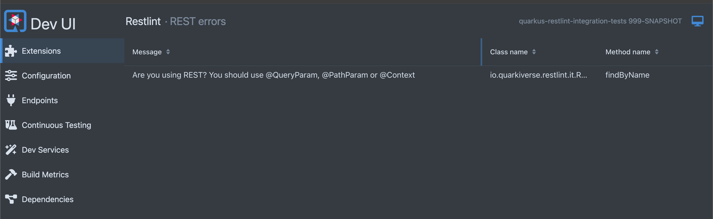

# Quarkus Restlint

This extension was created for the 18th JUG Vale event. 

Title: [Desbravando o Quarkus Criando extensōes para sua aplicação nativa de nuvem](https://docs.google.com/presentation/d/1ntc2m3EO6DRYGSkz6vOETGDPLXo2FWGi/edit#slide=id.p4)


The idea is to demonstrate what is possible to create with a Quarkus extensions.

The goal of this extension is to evict the developer to allow request body when using a GET verb.

```java
@GET
public Response findByName(Map<String, Object> body) {}
```

We want to assert that the developer have to use `@QueryParam`, `@Context` or `@PathParam`annotations.

```java
@GET
public Response findByName(@QueryParam("name") String name) {}
```

## Features

A DevUI page describing what errors has in the source code.



The source code responsible for creating this DevUI page can be found [here](./deployment/src/main/java/io/quarkiverse/restlint/deployment/RestlintProcessor.java).

## Links

### Writing extensions

If you want to learn more about how to create a Quarkus extension see the following links:

- https://matheuscruz.dev
- https://quarkus.io/guides/writing-extensions
- https://quarkus.io/guides/building-my-first-extension
